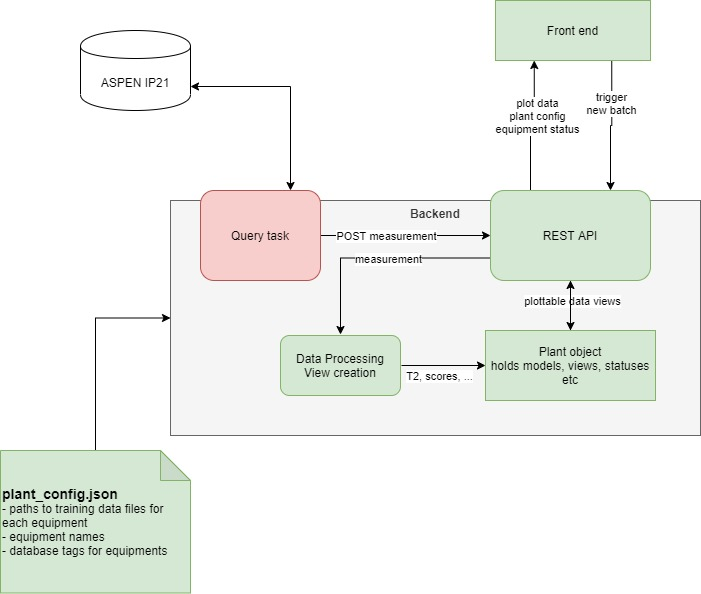
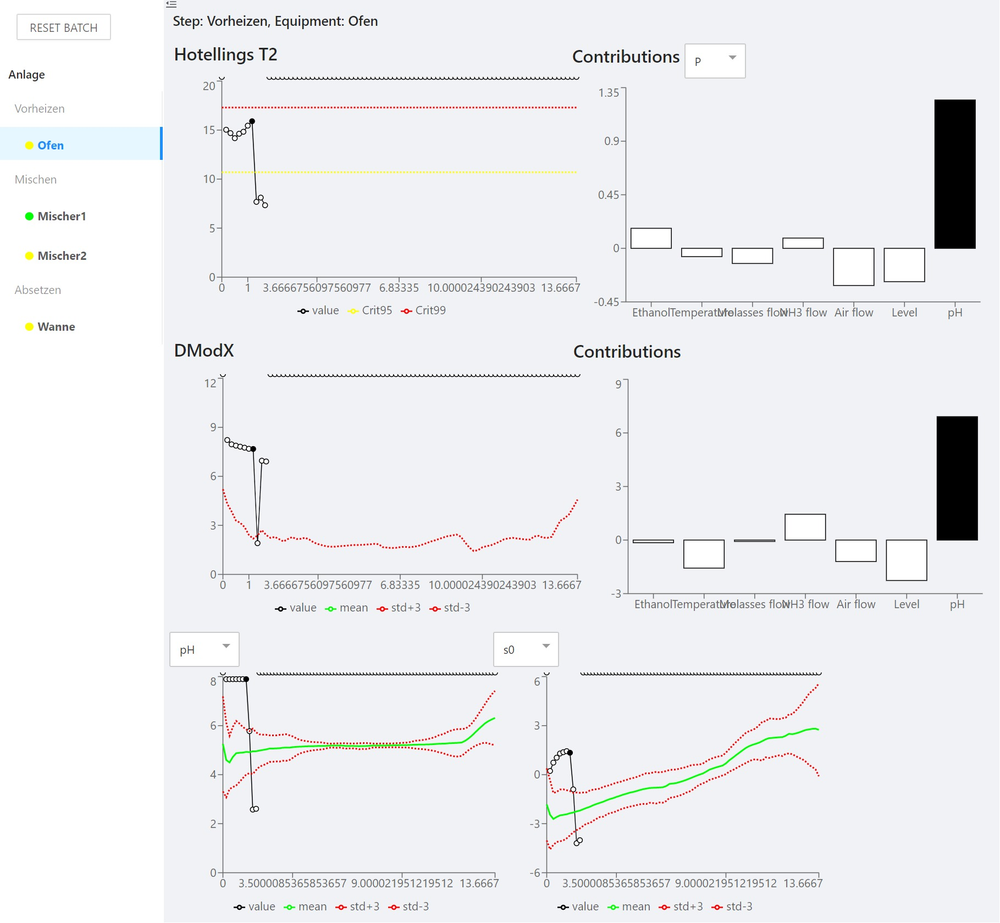

# Plant Monitor
Plant Monitor is combined back- and frontend application aimed to replace SIMCA Server for live batch process monitoring.

## Server
The backend is a _Flask_ REST API. It servers process data already formatted for plotting with [recharts](https://recharts.org) plotting library.
Additionally the API provides endpoints to add new process data to the current views.
By default the backend starts a seperate thread that queries data from a configured Aspen IP21 database and then posts the new live datapoints to the API.

## Webapp
React Javascript web application. Recharts for plotting. Designed with AntDesign.

